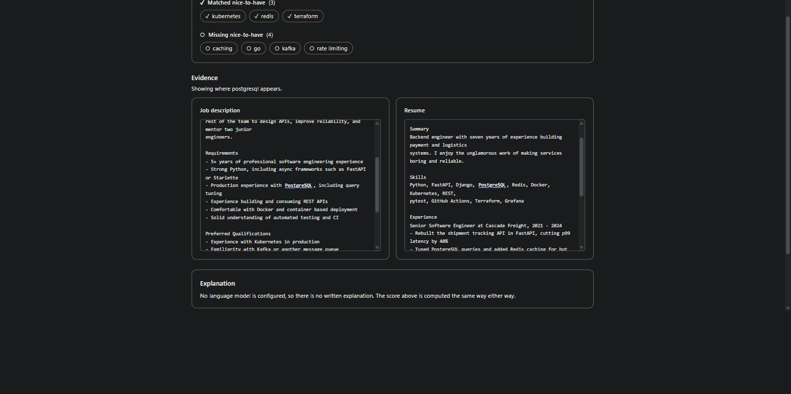
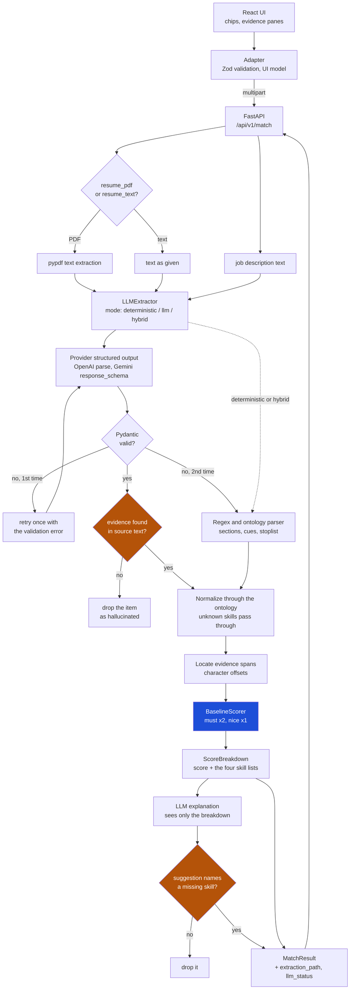

# Hiring Agent

Resume-to-job matching with hybrid keyword and LLM skill extraction, ontology
based normalization, deterministic auditable scoring, and CI via GitHub Actions.
Stack: FastAPI, React, Docker.

An LLM extracts skills and requirements into Pydantic-validated models, with a
regex and ontology parser as a fallback, and every extracted item carries an
evidence span that must appear verbatim in the source document or it is dropped.
The match score itself is computed deterministically from those skills, never by
the model, so the same inputs always produce the same number and every point of
it can be traced back to a line of text. A separate LLM pass explains the score,
and it is shown only the computed breakdown, so it cannot justify a number it
did not see.



Selecting a skill highlights the exact text it was extracted from, in both
documents at once. The offsets come from the backend, so the UI never has to
search for a span and cannot disagree with the score about where the evidence is.

## Example

```bash
curl -X POST http://localhost:8000/api/v1/match \
  -F "job_description=Senior Backend Engineer

Requirements
- Strong Python and PostgreSQL
- Comfortable with Docker

Preferred Qualifications
- Experience with Kubernetes" \
  -F "resume_text=Alex Morgan
alex.morgan@example.com

Skills
Python, FastAPI, PostgreSQL, Redis, Docker"
```

`resume_pdf` accepts a PDF upload instead of `resume_text`. Exactly one of the
two is required.

```jsonc
{
  "match_score": 0.857,
  "baseline_score": 0.857,
  "matched_skills": ["docker", "postgresql", "python"],
  "missing_skills": ["kubernetes"],
  "nice_matches": [],
  "llm_rationale": null,
  "suggestions": [],
  "extraction_path": "deterministic",
  "llm_status": "disabled",
  "request_id": "c90c98ac-b3a9-4d45-aabe-ed560a9c8d5f",
  "breakdown": {
    "must_matched": ["docker", "postgresql", "python"],
    "must_missing": [],
    "must_total": 3,
    "nice_matched": [],
    "nice_missing": ["kubernetes"],
    "nice_total": 1
  },
  "documents": {
    "jd": {
      "title": "Senior Backend Engineer",
      "source_text": "Senior Backend Engineer\n\nRequirements\n- Strong Python and Po...",
      "requirements": [
        {
          "skill": "postgresql",
          "priority": "must",
          "evidence": "Strong Python and PostgreSQL",
          "start": 58,
          "end": 68
        }
      ]
    },
    "resume": {
      "name": "Alex Morgan",
      "source_text": "Alex Morgan\nalex.morgan@example.com\n\nSki...",
      "skills": [
        {
          "skill": "python",
          "priority": null,
          "evidence": "Python, FastAPI, PostgreSQL, Redis, Docker",
          "start": 44,
          "end": 50
        }
      ]
    }
  }
}
```

`match_score` is 6 of 7 weighted points: three must-haves matched at weight 2,
one nice-to-have missed at weight 1.

Other endpoints:

| Endpoint | Purpose |
| --- | --- |
| `POST /api/v1/match` | Score a resume against a job description |
| `POST /api/v1/analyze` | The same, plus a full breakdown of gaps and overlap |
| `GET /api/v1/examples` | Two bundled sample pairs, used by the UI's try-it button |
| `GET /api/v1/info` | Effective configuration: provider, model, extraction mode |
| `GET /health` | Health check |

## Architecture



The blue node is the only thing that produces the number. Nothing downstream of
it can change the score.

## Design decisions

**Scoring stays deterministic.** The LLM improves the *inputs* to scoring, not
the score. A model asked to produce a number will produce a different one on a
rerun, cannot be audited, and gives a recruiter nothing to appeal to. Computing
the score from the extracted skill sets means it is reproducible, and the
arithmetic is small enough to explain in a sentence: must-haves weigh 2,
nice-to-haves weigh 1, matched over total.

**Every extracted item carries evidence.** The failure mode that matters in
hiring is a plausible fabrication: a model deciding a candidate "clearly knows
Kubernetes" because they mentioned Docker. Requiring a verbatim span, checked
against the source after whitespace normalization, turns that from a silent
error into a dropped item. Comparison is whitespace-insensitive because
providers reliably rewrap lines when copying a span while still quoting the
words faithfully; a paraphrase still fails.

**An ontology, not embeddings.** `javascript` and `JS` must score identically,
and a recruiter has to be able to see why two things were treated as the same
skill. A curated map is inspectable and editable; a similarity threshold is
neither. It costs coverage, which is a real limitation below.

**Hybrid mode by default.** The two extractors fail differently. The regex path
misses anything outside its ontology and cannot read an unusual layout; the LLM
path occasionally invents or drops things. Their union recovers more than either
alone, and on a priority conflict the LLM wins, because judging whether
"familiarity with Kafka would be useful" is a hard requirement is exactly what
the regex path is bad at. `extraction_path` records which ran, and `fallback` is
deliberately distinct from `deterministic` so a silently degraded LLM does not
look like a deliberate configuration.

**The frontend adapter validates every response.** `services/adapter.ts` is the
only code that touches raw API shapes. Everything else imports a UI model. A
malformed response becomes a typed error state instead of a crash or a blank
screen, and a wire-format change cannot ripple through the view layer. The
adapter also rejects offsets that are inverted or run past the end of the text,
because highlighting those renders an invisible empty mark rather than failing
loudly.

**The explainer is shown only the breakdown.** It never receives the resume or
the job description, so it has nothing to mine for claims the score did not
account for. `explain()` takes exactly one argument and a test asserts that
signature, so widening it has to be a deliberate act.

## Eval

`eval/run_eval.py` reports precision, recall and F1 per field, micro-averaged
across cases, plus must/nice classification accuracy scored over skills present
in both the gold labels and the prediction.

**There are no numbers to report yet.** Gold labels are written by hand, and the
two cases in `eval/data/` ship with empty label lists on purpose. Until they are
labeled, `run_eval.py` reports `0` labeled cases and computes nothing, and the
CI F1 gate stays switched off.

| Mode | Cases | Micro F1 | Must/nice accuracy |
| --- | --- | --- | --- |
| Deterministic, before the Phase 2 fixes | 0 labeled | not measured | not measured |
| Deterministic, after the Phase 2 fixes | 0 labeled | not measured | not measured |
| LLM | 0 labeled | not measured | not measured |
| Hybrid | 0 labeled | not measured | not measured |

To fill this in: label 15 to 25 cases following `eval/README.md`, run each mode,
and set the `EVAL_MIN_F1` repository variable to the deterministic figure so CI
fails on a regression.

What *can* be said without labels, because it is visible in the extractor output
on the two sample cases: before the fixes, the job description parser returned
an empty nice-to-have list on both (every preferred qualification was promoted
to a hard requirement), invented `business analyst` from the word
"Requirements", matched `rest` against the phrase "the rest of the team", and
the resume parser returned no skills at all, because a summary line containing
the word "experience" was treated as a section header and swallowed the skills
section. All four are now covered by tests.

## Known limitations

- **Keyword presence is not depth of experience.** A resume that lists Python
  once scores the same as one that shows five years of it. The score is a
  screening aid, not a judgement, and the UI says so.
- **The eval set is small and hand-labeled by one person.** Two example cases
  exist and are unlabeled. Even at the target of 15 to 25, one person's
  judgement on a borderline requirement is the ground truth, and the confidence
  interval on an F1 from that many cases is wide.
- **Ontology coverage is the recall ceiling.** The deterministic path can only
  find skills the ontology knows. Coverage was extended substantially, but
  anything missing is silently invisible to that path. The LLM path is what
  catches the rest, which is part of why hybrid is the default.
- **Ambiguous short tokens are a deliberate precision trade.** `go`, `rest`,
  `find` and similar only count as skills in a list context or beside a
  disambiguating word. That costs recall on prose like "Go experience wanted"
  written outside a bulleted requirements section.
- **Years of experience and education are not scored at all.** They are parsed
  but contribute nothing to the number.
- **Nothing is persisted.** Uploads go to a temp file and are deleted after each
  request. There is no authentication and no rate limiting; see `SECURITY.md`
  before exposing this publicly.

## Running it

### Locally

```bash
python -m venv .venv
.venv/Scripts/activate        # Windows; use source .venv/bin/activate elsewhere
pip install -r requirements-dev.txt

cp .env.example .env          # optional: the API works without an LLM key
uvicorn api.main:app --reload
```

The API is then on <http://localhost:8000>. For the UI in development:

```bash
cd frontend
npm install
npm run dev                   # http://localhost:5173, proxies /api to port 8000
```

Without `LLM_API_KEY` the app runs the deterministic path and stays fully
functional: `llm_status` is `disabled` and the UI says the score stands without
a written explanation.

### With Docker

One image builds the UI and serves it alongside the API from a single origin,
which is why production needs no CORS configuration.

```bash
docker build -t hiring-agent .
docker run -p 8000:8000 --env-file .env hiring-agent
```

The UI is then at <http://localhost:8000> and the API under `/api`. The
container runs as a non-root user.

### Tests and eval

```bash
pytest                        # backend, no network access, no API key needed
python eval/run_eval.py --mode deterministic

cd frontend
npm run typecheck
npm run lint
npm test                      # API mocked at the fetch boundary
```

`--mode llm` and `--mode hybrid` need `LLM_API_KEY` and exit with guidance
without it.

### Configuration

| Variable | Default | Meaning |
| --- | --- | --- |
| `LLM_PROVIDER` | `openai` | `openai` or `gemini` |
| `LLM_API_KEY` | unset | Leave empty to run the deterministic path only |
| `LLM_MODEL` | per provider | `gpt-4o-mini` or `gemini-2.5-flash` |
| `EXTRACTION_MODE` | `hybrid` | `deterministic`, `llm` or `hybrid` |

## Layout

```
api/          FastAPI app, request handling, bundled public examples
core/
  config.py     environment configuration
  extraction/   LLM extraction, provider adapters, evidence spans
  normalize/    skill ontology and normalizer
  parsers/      deterministic resume and JD parsers
  schemas/      Pydantic models
  scoring/      deterministic scorer, grounded explanation, aggregator
eval/         evaluation harness, cases, results
frontend/     React UI, Zod adapter, Vitest tests
tests/        backend test suite
```

## Licence

MIT.
